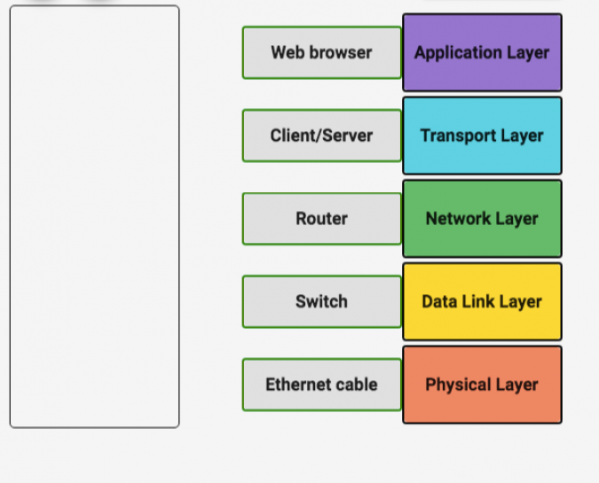

# Networking Explained

*Five-layer Model*

**Physical Layer** : This provide the means of transferring streams of data over a physical medium . The physical layer transfers data by converting it into electric signals and sends in through a wired or wireless medium (networking cable,  network adapters, ethernet, repeaters, networking hubs)

**Data Link Layer** : Responsible for interpreting the data transmitted in the physical layer , it allows protocols that makes sense of the streams of signals transferred in the physical layer 

**Network Layer** : Allows Diffrent network to connect with each other, responsible for getting data across a collection of networks, from one node to another.It selects and manages the best logical path for data transfer between nodes (IP)

**Transport Layer** : Sorts out who is suppose to get that data, make sure it gets to them . (TCP, UDP)

**Application Layer** : content
